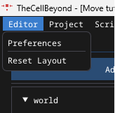
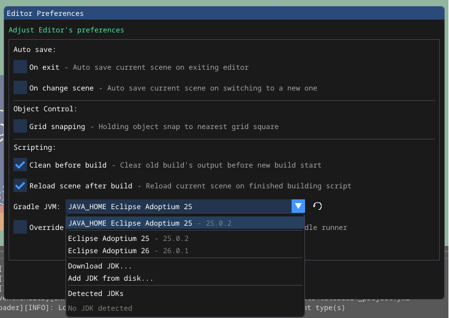
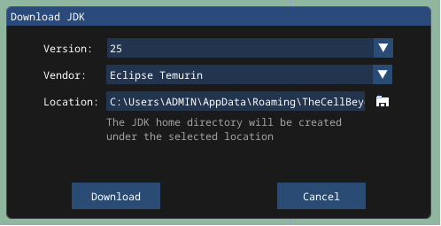
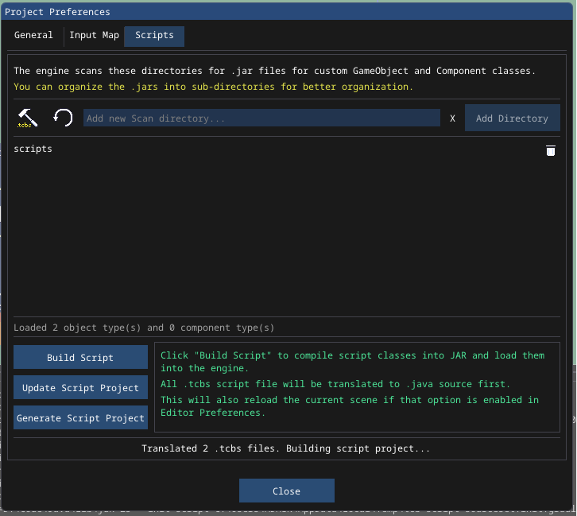
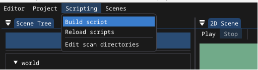

<div style="text-align: center;" align="center">


# TheCellBeyond Game Engine

**A 2D game engine in Java, with scripting support and editor UI for building scenes and levels**

</div>

## Running the engine
The executable from release contains a bundled JRE needed to run the core engine and potential prebuilt script jar file.

The generated script project come with Gradle wrapper, but still require [JDK 25](https://adoptium.net/temurin/releases?version=25&os=any&arch=any) in order to jar the script.

<details>
    <summary><b><u>Managing JDK within the Engine's Editor</u></b></summary>

Since version `1.8.6`, The engine offer UI control to manage and download the JDK used by Gradle JVM.
These preferences can be access via Menu bar, Editor -> Preferences

<br>
*Editor Preferences menu item*

<br>
*Selectable JDK from the drop-down*

<br>
*Download JDK dialog*

On macOS and Linux, the download JDK will have their executable bit set, additionally, quarantine attribute will be stripped on macOS.

</details>

> [!IMPORTANT]
> Due to lack of signing, the engine file on macOS might be blocked from executing.
> This can be bypassed by granting the app permission in terminal:
> ```
> xattr -cr /path/to/TheCellBeyond_<version>.app
> ```
> Alternatively, right click and choose **Open** and confirm on the dialogue to bypass restriction.

## Scripting

The engine's API is available on [Maven central repository](https://central.sonatype.com/artifact/io.github.baole444/thecellbeyond-api), which had been marked as `compileOnly` in the [build.gradle](https://github.com/baole444/TheCellBeyond/blob/Dev-build/src/main/resources/templates/script-project/build.gradle) 
generated for scripting project.

For any other dependencies that might be brought in, they need to be `implementation` instead of `compileOnly`.

### Compatibility
Below is the minimum API version for scripting to be compatible with the engine's release version:

| Engine version  |                                        API version                                        |
|:---------------:|:-----------------------------------------------------------------------------------------:|
| __1.8 - 1.8.8__ | [__1.8__](https://central.sonatype.com/artifact/io.github.baole444/thecellbeyond-api/1.8) |
|       1.7       |   [1.7](https://central.sonatype.com/artifact/io.github.baole444/thecellbeyond-api/1.7)   |
|   1.6 - 1.6.1   |   [1.6](https://central.sonatype.com/artifact/io.github.baole444/thecellbeyond-api/1.6)   |
|   1.5 - 1.5.2   |   [1.5](https://central.sonatype.com/artifact/io.github.baole444/thecellbeyond-api/1.5)   |
|       1.4       |   [1.4](https://central.sonatype.com/artifact/io.github.baole444/thecellbeyond-api/1.4)   |

*Using any version older than __1.8.8__ might not work properly (The version mention in this increased if new release contain fix for crashes or incorrect logic.)*


<details>
    <summary><b><u>Building script</u></b></summary>

Since version `1.8.6`, script project can now be built within the Engine's Editor UI.
This requires the script project is generated first.

<br>
*Scripts Tab layout in Project Preference*

<br>
*Build script menu item*

Beside generate and build script, the Scripts Tab also allow update existing script project so it is up-to-date with the engine's template.

Script project can still be build manually using the jar task:
```bash
gradlew jar
```
For Windows:
```bash
./gradlew.bat jar
```

</details>

### Annotate a class as GameObject type:
```java
import components.AnimatedSpriteRenderer;
import physic2d.CharacterBody2D;
import scripting.RegisterGameObject;
import utility.HierarchyPaths;

@RegisterGameObject(label = "Player Object", description = "Main player controlled object")
public class MainPlayer extends CharacterBody2D {
    public AnimatedSpriteRenderer animation2D;
    
    @Override
    protected void onReady() {
        animation2D = (AnimatedSpriteRenderer) HierarchyPaths.toComponent("::Animation2D", this);
    }
    
    @Override
    protected void onPhysicUpdate(float dt) {
        // Other logic you might have
        moveAndSlide();
    }
}
```

### Annotate a class as Component type:
```java
import components.StateEngine;
import scripting.RegisterComponent;

@RegisterComponent(label = "Main char state engine", description = "State engine for main character")
public class MainStateEngine extends StateEngine {
    @Override
    protected void onReady() {
        switchState("Idle");
    }
}
```

### Annotate a field with Export for editing in the editor UI:
```java
import org.joml.Vector2f;
import physic2d.CharacterBody2D;
import scripting.RegisterGameObject;
import scripting.Export;
import scripting.TypeHint;

@RegisterGameObject(label = "Player Object", description = "Main player controlled object")
public class MainPlayer extends CharacterBody2D {
    public enum Direction {
        Left(-1),
        Right(1);
        
        public final int x;
        
        Direction(int x) {
            this.x = x;
        }
    }
    
    @Export
    public float movementSpeed = 2.0f;
    
    @Export(label = "Custom label",  description = "Custom field", type = TypeHint.Vector2)
    public Vector2f currentDirection = new Vector2f();
    
    @Export(label = "Starting direction")
    public Direction startingDir = Direction.Right;
}
```

For most cases, defining type for the exporting variables is optional, unless the editor's inspector is recognizing something incorrectly.

<details>
    <summary><b>Example script classes</b></summary>

```java
package character;

import components.AnimatedSpriteRenderer;
import physic2d.CharacterBody2D;
import scripting.Export;
import scripting.RegisterGameObject;
import states.AlulaEngine;
import utility.HierarchyPath;
import utility.HierarchyPaths;

@RegisterGameObject(description = "Player controlled object")
public class Alula extends CharacterBody2D {
    public enum Direction {
        Up,
        Down,
        Left,
        Right
    }

    @Export(label = "Direction")
    public Direction direction = Direction.Down;
    public final String AnimationPath = HierarchyPath.ComponentDelimiter + "Animation";
    public AnimatedSpriteRenderer animation;

    public final String WalkUp = "walk_up";
    public final String WalkDown = "walk_down";
    public final String WalkLeft = "walk_left";
    public final String WalkRight = "walk_right";

    @Override
    protected void onStart() {
        addComponent(new AlulaEngine());
    }

    @Override
    protected void onReady() {
        animation = (AnimatedSpriteRenderer) HierarchyPaths.toComponent(AnimationPath, this);
        updateAnimation();
    }

    @Override
    protected void onPhysicUpdate(float dt) {
        driveDirection();
        moveAndSlide();
    }

    public void updateAnimation() {
        if (animation == null) return;
        animation.setCurrentAnimation(switch (direction) {
            case Up -> WalkUp;
            case Down -> WalkDown;
            case Left -> WalkLeft;
            case Right -> WalkRight;
        });
    }

    private void driveDirection() {
        if (velocity.y < 0.0f) {
            direction = Direction.Down;
            return;
        }
        if (velocity.y > 0.0f) {
            direction = Direction.Up;
            return;
        }
        if (velocity.x < 0.0f) {
            direction = Direction.Left;
            return;
        }
        if (velocity.x > 0.0f) direction = Direction.Right;
    }
}
```

```java
package states;

import character.Alula;
import components.NotSerializeComponent;
import components.StateEngine;

public class AlulaEngine extends StateEngine implements NotSerializeComponent {
    @Override
    protected void onStart() {
        if (!(gameObject instanceof Alula alula)) return;
        enableAutoStateTransition = true;
        addState("Idle", new Idle(alula));
        addState("Up", new Up(alula));
        addState("Down", new Down(alula));
        addState("Left", new Left(alula));
        addState("Right", new Right(alula));
        setDefaultState("Idle");
    }
}
```

More can be found under [Test Resource](test%20resource/test_project/scripts-src).

</details>

### Using TCBScript:

TCBScript (TheCellBeyond Scripting Language), is a Python and GDScript inspired scripting language used by the engine.
`.tcbs` files can be place anywhere (except `generated/` directory) under the `scripts-src` directory.
The scripting language is supported by the engine since version `1.8.6`.

Under TCBScript, the source is first translated to Java source file, then build along with the rest of the Java source as normal.
The API used under TCBScript are converted to snake_case for ease of use. A wiki for it will be published soon.

Example scripts:
```tcbs
class Calamus extends CharacterBody2D

const animation_path = HierarchyPath.ComponentDelimiter + "animation"
const alula_detector_path = "alula_detector"

@export var moveSpeed = 0.16

@export var direction = Direction.Up

var animation : AnimatedSpriteRenderer

var alula : Alula

func _ready() -> void:
    animation = HierarchyPaths.to_component(animation_path, self) as AnimatedSpriteRenderer

    var alula_detector = HierarchyPaths.to_game_object(alula_detector_path, self) as Area2D

    if alula_detector != null:
        alula_detector.body_entered.connect(on_alula_enter)
        alula_detector.body_exited.connect(on_alula_exit)

func on_alula_enter(body : GameObject2D) -> void:
    if not body is Alula: return
    alula = body as Alula
    print("Alula entered")

func on_alula_exit(body : GameObject2D) -> void:
    if not body is Alula: return
    alula = null
    print("Alula left")
```

```tcbs
enum Direction:
    Up
    Down
    Left
    Right
```

<details>
    <summary><b>Generated Sources</b></summary>

These are Java source generated from `.tcbs` files and placed under `generated/tcb-script-java/*`.

```java
// generated from src/main/java/character/Calamus.tcbs - edit if you know what you are doing
package scripts;

import TheCellBeyond.GameObject2D;
import character.Alula;
import components.AnimatedSpriteRenderer;
import physic2d.Area2D;
import physic2d.CharacterBody2D;
import scripting.Export;
import scripting.RegisterGameObject;
import signal.Callable;
import utility.HierarchyPath;
import utility.HierarchyPaths;
import utility.log.EngineLog;

@RegisterGameObject
public class Calamus extends CharacterBody2D {
    private static final EngineLog Logger = new EngineLog(Calamus.class);

    public final String animation_path = (HierarchyPath.ComponentDelimiter + "animation");

    public final String alula_detector_path = "alula_detector";

    @Export
    public float moveSpeed = 0.16f;

    @Export
    public Direction direction = Direction.Up;

    public AnimatedSpriteRenderer animation;

    public Alula alula;

    @Override
    protected void onReady() {
        animation = ((AnimatedSpriteRenderer) HierarchyPaths.toComponent(animation_path, this));
        Area2D alula_detector = ((Area2D) HierarchyPaths.toGameObject(alula_detector_path, this));
        if ((alula_detector != null)) {
            alula_detector.bodyEntered.connect(Callable.get(this, "on_alula_enter"));
            alula_detector.bodyExited.connect(Callable.get(this, "on_alula_exit"));
        }
    }

    public void on_alula_enter(GameObject2D body) {
        if ((!(body instanceof Alula))) {
            return;
        }
        alula = ((Alula) body);
        Logger.info("Alula entered");
    }

    public void on_alula_exit(GameObject2D body) {
        if ((!(body instanceof Alula))) {
            return;
        }
        alula = null;
        Logger.info("Alula left");
    }
}
```

```java
// generated from src/main/java/character/Direction.tcbs - edit if you know what you are doing
package scripts;

public enum Direction {
    Up,
    Down,
    Left,
    Right
}
```

</details>

### Additional notes:

[Third parties notices document](build%20resources/THIRD-PARTY-NOTICES.txt)